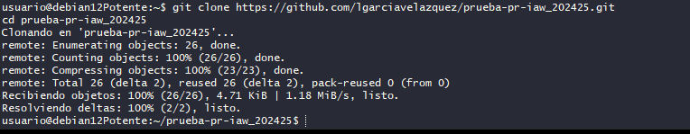
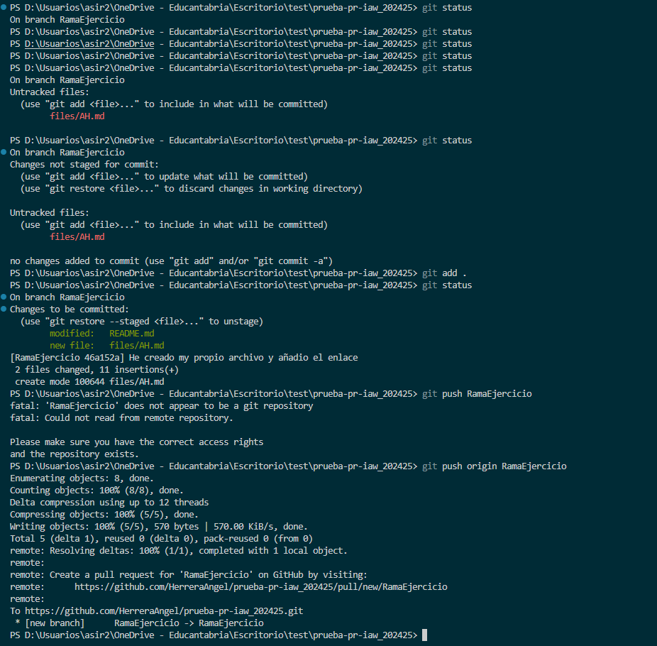
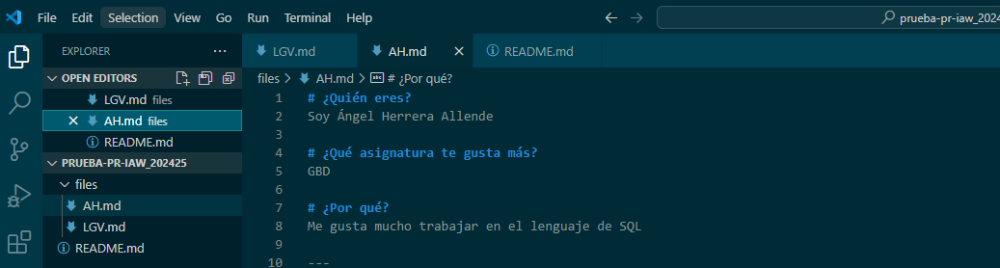
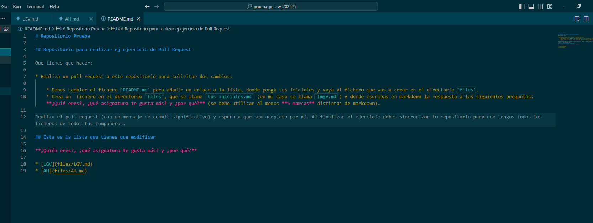
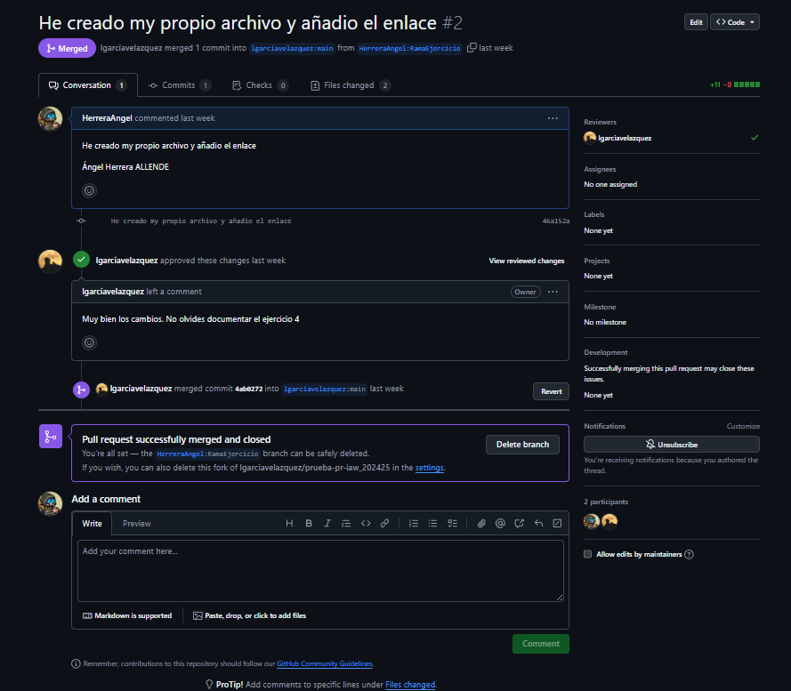

## Paso 1
Empezamos clonando el repositorio 

¡
## Paso 2
Tras esto haremos una rama aqui se puede ver comprueba que este en mi rama aparte en vez de la main  

# Paso 3 
Creacion del archivo Markdown solicitado

# Paso 4 
Insertacion del enlace a este 

# Paso 5
Solicitar el Pull request al propietario de la repositiorio original 
(Se me olvido hacer captura por lo que pondre una tras esto)

